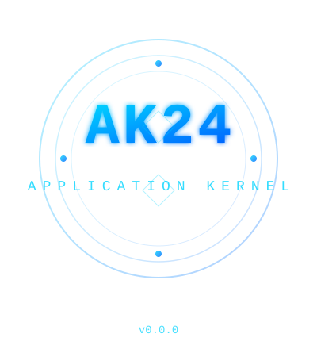

  

AK24 (Application Kernel 24) is a lightweight C library providing core data structures and memory management primitives for building robust applications. The kernel includes generic containers (lists, maps, buffers), lambda abstractions, context management, and optional Boehm GC integration. All components are thoroughly tested at compile-time to ensure correctness and type safety. AK24 is designed to be embedded as a foundational layer in larger application architectures.

