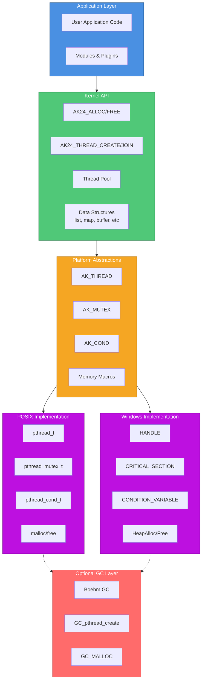
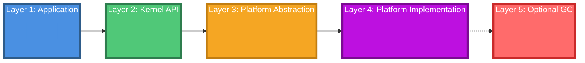

# AK24 Platform Abstraction Layers

## Legend

- 🔵 **Application Layer** - User code, modules, plugins
- 🟢 **Kernel API** - High-level AK24 functions and data structures
- 🟠 **Platform Abstraction** - AK_* types and macros (cross-platform interface)
- 🟣 **Platform Implementation** - POSIX pthread or Windows threads
- 🔴 **Optional GC Layer** - Boehm garbage collector (compile-time option)
